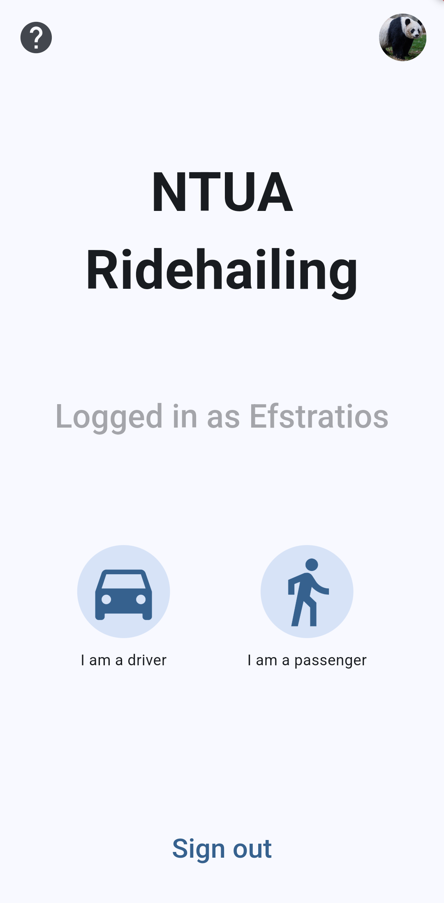
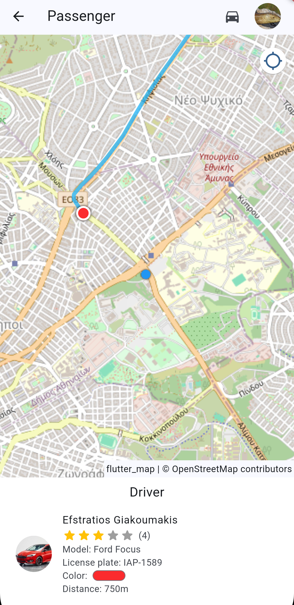
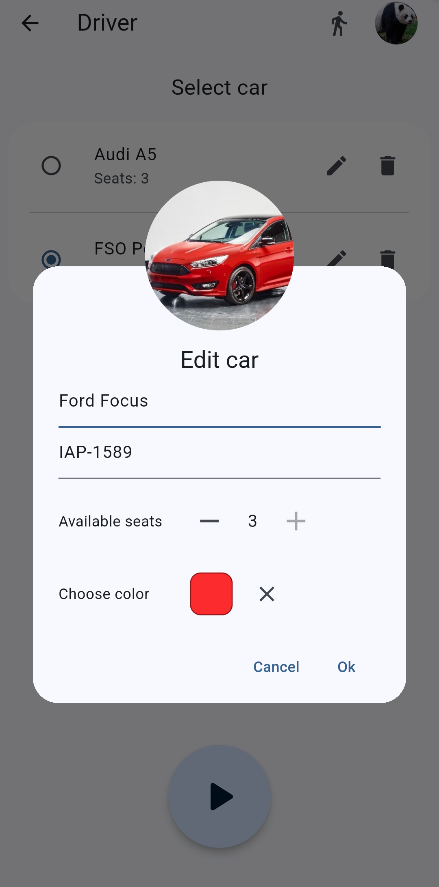

# NTUA Ridehailing

A ride-sharing app made for students of the National Technical University of Athens.
Users can choose to be drivers or passengers, and the app will coordinate the shared ride with their fellow students.

Developed as part of my thesis. More info can be found [here](https://github.com/StratosGiak/Thesis)

## Preview

<table>
    <thead>
        <tr>
            <th>
                

                    Screenshots
                

            </th>
        </tr>
    </thead>
    <tbody>
    <tr>
        <td>
            
            
            
        </td>
    </tr>
    </tbody>
</table>

|              Managing cars               |
| :--------------------------------------: |
|  |

|              Sharing a ride              |
| :--------------------------------------: |
|  |
